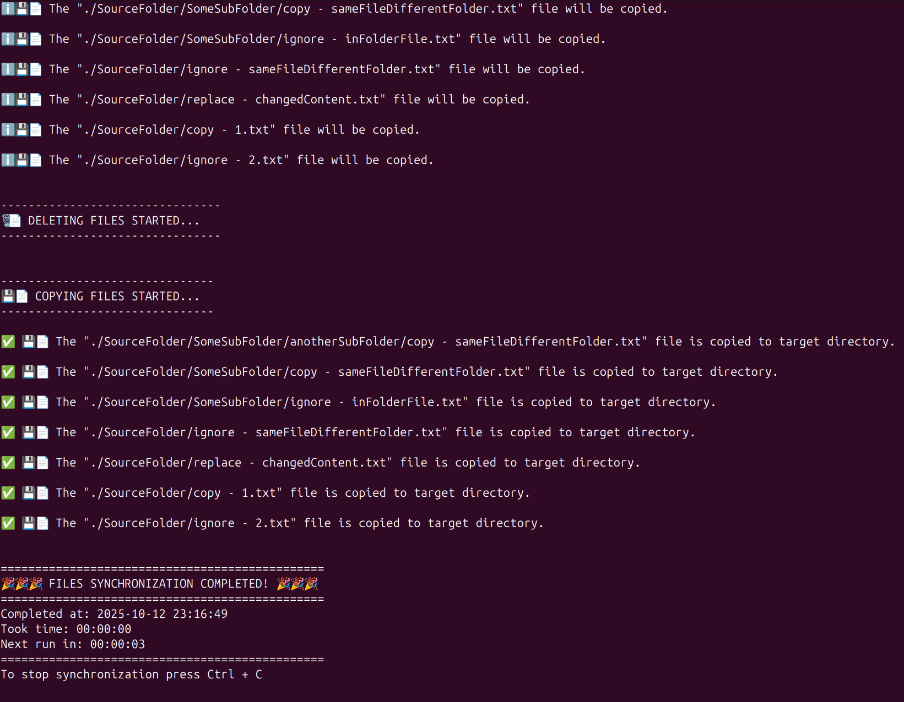

# 🗂️ Folder Synchronizer

A C# console app that periodically synchronizes a target folder with a source folder to keep them identical.



**💡 Optimization:** The application does not touch folders and files that have identical relative paths and MD5 hashes (for files).

### ✨ It can:

⏰ Use a timer to trigger synchronization

🚫 Prevent overlapping runs – skips the run if the previous is not finished

📄 Log all actions (file creation, copying, deletion, alerts) to both the console and a log file

### 💻 Via command-line arguments you can provide:

* `--sourceDir` – path to the source folder
* `--targetDir` – path to the replica (target) folder
* `--logs` – path to the log file
* `--repeatTimePeriod` – synchronization interval in milliseconds (0 or not provided = run once)
* `--logPreActions` – optional flag to log planned actions before execution

### ⚡ To run the app:

1. Clone the repository into the needed folder
1. Navigate to the `dotnet-folder-synchronizer` folder in the terminal
1. Navigate to the folder

```bash
cd bin/Release/net9.0/linux-x64/publish/
```

4. Make the file executable (if it’s not already)

```bash
chmod +x FoldersSynchronizer
```

5. Prepare folders and paths

6. Run it after replacing arguments with needed values

```bash
./FoldersSynchronizer --sourceDir ./SourceFolder --targetDir ./TargetFolder --logs ./logs.txt --repeatTimePeriod 3000 --logPreActions
```

## Development

### To develop

1. Clone the repository into the needed folder
1. Navigate to the `dotnet-folder-synchronizer` folder in the terminal
1. Run `dotnet build`
1. Make some changes
1. Finally, run the command below:

```bash
dotnet publish -c Release -r linux-x64 --self-contained true /p:PublishSingleFile=true /p:PublishTrimmed=true
```

After that, you can grab your file from the `dotnet-folder-synchronizer/bin/Release/net9.0/linux-x64/publish/FoldersSynchronizer` folder and execute it as shown above in the "**⚡ To run the app**" section.
